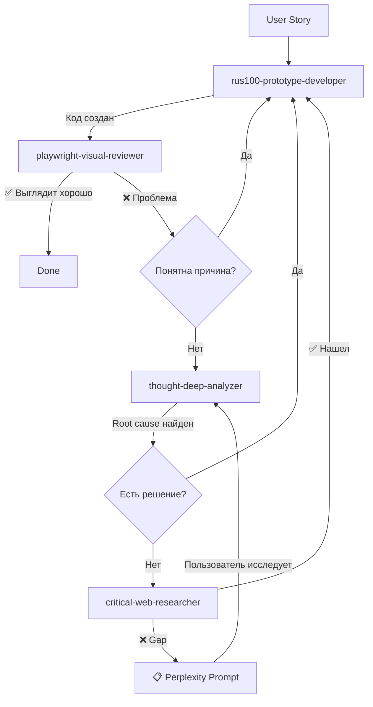

# Claude Code Agents for rus100

Система специализированных агентов для разработки UX/UI прототипа rus100 (платформа подготовки к ЕГЭ по русскому языку).

## 🎯 Философия

**От идеи до рабочего UI через цепочку специалистов**:
1. **Разработчик** создает код
2. **Глаза** проверяют визуал
3. **Исследователь** ищет решения проблем
4. **Мыслитель** анализирует root cause
5. **Локаторы/Анализаторы** помогают ориентироваться в коде

---

## 📁 Структура агентов

```
.claude/
├── README.md                          # Этот файл
├── playwright-visual-reviewer.md       # 👁️ Глаза пользователя
├── critical-web-researcher.md          # 🔬 Критический исследователь
├── rus100-prototype-developer.md       # 💻 Основной разработчик
├── thought-deep-analyzer.md            # 🧠 Глубокий анализ
├── prototype-pragmatist.md             # 🛡️ Фильтр overengineering
├── prototype-realist.md                # 📏 Честная оценка готовности
├── codebase-locator.md                 # 🗺️ Навигатор по коду
├── codebase-analyzer.md                # 📖 Анализатор кода
└── thoughts-locator.md                 # 🔍 Поиск паттернов

screenshots/                            # Визуальные артефакты
└── [component-name]-[timestamp].png
```

---

## 🔄 Workflow: От задачи до результата



---

## 🚀 Core Agents (Tier 1)

### 1. rus100-prototype-developer 💻
**Роль**: Основной разработчик UI прототипов

**Когда использовать**:
- "Создай страницу списка тестов"
- "Добавь компонент карточки группы"
- "Исправь layout в DashboardStats"
- "Сделай responsive версию таблицы"

**Что умеет**:
- ✅ Next.js 15 App Router pages
- ✅ shadcn/ui + design tokens
- ✅ Mock data на русском
- ✅ Atomic Design (atoms/molecules/organisms)
- ✅ Responsive layouts
- ✅ TypeScript strict mode

**Что НЕ делает**:
- ❌ Backend/API (это прототип!)
- ❌ Аутентификация (не нужна для прототипа)
- ❌ Оптимизация (не приоритет)

**Пример**:
```bash
User: "Создай страницу списка тестов с фильтрами"
Agent:
1. Читает CLAUDE.md (паттерны)
2. Ищет похожие страницы (codebase-locator)
3. Создает mock data
4. Пишет компонент TestCard
5. Создает app/tests/page.tsx
6. Запрашивает visual review
```

**Файл**: `.claude/rus100-prototype-developer.md`

---

### 2. playwright-visual-reviewer 👁️
**Роль**: "Глаза пользователя" - визуальный тестер

**Когда использовать**:
- "Посмотри как выглядит компонент X"
- "Проверь отступы в GroupCard"
- "Работают ли sticky headers?"
- "Как выглядит на мобилке?"

**Что умеет**:
- ✅ Фокусные скриншоты (экономия токенов 80-90%)
- ✅ CSS metrics (padding, margin, colors, fonts)
- ✅ Responsive проверка (mobile/tablet/desktop)
- ✅ Accessibility (contrast, focus indicators)
- ✅ Сравнение с CONTRACT-*.yml

**Workflow**:
1. Запускает dev server (port 3001)
2. Открывает страницу в Playwright
3. Делает фокусный скриншот компонента
4. Собирает CSS метрики
5. Проверяет responsive
6. Создает отчет с визуальными проблемами

**Пример отчета**:
```markdown
## Visual Review: GroupCard

Screenshot: .claude/screenshots/group-card-desktop.png

Metrics:
- Padding: 24px 16px
- Font Size: 16px
- Background: #FFFFFF
- Border Radius: 8px

❌ Проблемы:
1. Контраст текста 3.2:1 (требуется ≥4.5:1)
2. Focus indicator не виден

✅ Хорошо:
1. Responsive layout корректен
2. Spacing консистентен
```

**Файл**: `.claude/playwright-visual-reviewer.md`

---

### 3. critical-web-researcher 🔬
**Роль**: Критический исследователь БЕЗ wishful thinking

**Когда использовать**:
- "Почему sticky headers не работают с grid?"
- "Лучшие практики для responsive tables"
- "Как решить проблему X в Next.js 15?"

**Что отличает от обычного researcher**:
```diff
- ❌ Ищет подтверждение "это работает"
+ ✅ Ищет правду "почему НЕ работает"

- ❌ Первый результат = ответ
+ ✅ Проверяет 3+ источника, ищет противоречия

- ❌ Игнорирует даты
+ ✅ Только 2024-2025 для Next.js 15

- ❌ Не замечает пробелы в знаниях
+ ✅ Объявляет "gap detected" и генерирует Perplexity prompt
```

**Принципы**:
1. **Скептицизм** - не верю пока не проверю
2. **Ищи проблемы** - "why NOT working", а не "how to fix"
3. **Проверяй даты** - 2024-2025 актуально, 2018 устарело
4. **Противоположные мнения** - ищи и "за" и "против"
5. **Обнаруживай gaps** - "мне не хватает знаний"

**Gap Detection → Perplexity Prompt**:
```yaml
status: gap_detected
confidence: low
reason: "Нет информации о sticky + grid в Next.js 15 SSR"

perplexity_prompt: |
  Research CSS sticky positioning with CSS Grid in Next.js 15:

  Problem: position: sticky on <th> inside grid + overflow container

  What I need:
  1. Root cause (CSS spec)
  2. Verified workarounds (with trade-offs)
  3. Production examples

  Sources: MDN, CSS WG, Next.js docs (2024+)
```

**Файл**: `.claude/critical-web-researcher.md`

---

## 🧠 Thinking Agents (Tier 2)

### 4. thought-deep-analyzer 🧠
**Роль**: Глубокий анализ с инструментами мышления

**Когда использовать**:
- "Почему X не работает?" (root cause)
- "Проанализируй провал этого фикса"
- "Что мы упускаем в решении?"
- "Предскажи почему это может сломаться"

**Инструменты мышления**:

| Инструмент | Когда использовать | Что дает |
|------------|-------------------|----------|
| **5 Whys** | Bug, непонятная проблема | Root cause |
| **First Principles** | Архитектурное решение | Фундаментальные истины |
| **Inversion** | Рефакторинг, design | Что НЕ делать (anti-patterns) |
| **Pre-Mortem** | Оценка решения | Предсказание провала |
| **Steel Man** | Выбор между вариантами | Сильнейший контраргумент |

**Пример (5 Whys)**:
```markdown
Проблема: Sticky headers не работают

Why #1: Почему не работают?
→ position: sticky не применяется

Why #2: Почему не применяется?
→ CSS grid меняет stacking context

Why #3: Почему grid?
→ Нужен layout с фиксированными колонками

Why #4: Почему фиксированные?
→ useColumnWidths требует синхронизации

Why #5: Почему синхронизация?
→ Архитектурное решение для alignment

ROOT CAUSE: Архитектурный конфликт
Grid (layout needs) vs Sticky (positioning needs)
```

**Файл**: `.claude/thought-deep-analyzer.md`

---

## 🛡️ Quality Guardians (Tier 1.5)

### 5. prototype-pragmatist 🛡️
**Роль**: Фильтр overengineering для прототипов

**Стиль**: Без списков, прямая речь, для умного собеседника. Говорит правду без sycophancy.

**Когда использовать**:
- "Посмотри код перед merge, не слишком ли сложно?"
- "Проверь этот рефакторинг на overengineering"
- "Нужен ли тут Redux или useState достаточно?"
- "Стоит ли настраивать кастомный webpack для прототипа?"

**Что ловит**:
Архитектурный overkill (Clean Architecture для трёх страниц), state management paranoia (Redux для простых компонентов), abstraction addiction (utils для функций используемых один раз), testing theater (unit tests ради coverage без реальной пользы), преждевременную оптимизацию (memo везде), configuration overkill (кастомные webpack конфиги), package.json obesity (зависимости которые не нужны).

**Философия**:
Прототип существует чтобы проверить UX гипотезу быстро. Каждая строка кода стоит времени. Сложность должна доказывать своё право на существование, а не наоборот. По умолчанию — просто. Если хочется сложно — объясните зачем.

**Пример работы**:
```
User: "Настроил Redux Saga для async actions в прототипе"

Pragmatist: "А зачем? У вас три компонента и пять async действий.
Redux Toolkit thunks покрывают это за 10 строк. Saga добавляет
сложность без выигрыша. Прототип меняется каждый день, зачем
закладывать архитектуру на годы для демо на две недели?

Если правда нужна orchestration сложных async flows — ок,
покажите где. Если нет — useState + async/await достаточно."
```

**Файл**: `.claude/prototype-pragmatist.md`

---

### 6. prototype-realist 📏
**Роль**: Честная оценка готовности прототипа

**Стиль**: Без списков, прямая речь, не льстит. Отличает "работает у меня" от "готово к демо".

**Когда использовать**:
- Перед демо stakeholders
- Перед деплоем на GitHub Pages
- Когда сомневаетесь "а точно готово?"
- Когда нужна реалистичная оценка completion

**Что проверяет**:
Happy path (основной флоу без ошибок), unhappy paths (неожиданные действия пользователя), визуальную консистентность (design tokens используются, нет hardcoded values), работу на реальных устройствах (не только Chrome DevTools), loading states (пользователь видит что происходит), edge cases (длинные имена, много элементов, пустые состояния), известные проблемы (documented в CONTRACT или fixed).

**Градации готовности**:
Demo-ready (можно показывать сейчас), Almost demo-ready (1-2 часа доработки), Functional but not polished (1-2 дня), Partial implementation (честно сказать что готово частично), Broken (не работает даже основное).

**Пример работы**:
```
User: "ResponsiveStatsTable готова к демо"

Realist: "Проверил. Статус: Almost demo-ready.

Happy path работает - таблица рендерится, данные показываются,
сортировка работает. Responsive переключение mobile/desktop на месте.

Проблема: sticky headers не работают в desktop версии. Это
известная проблема из CONTRACT-ADDENDUM, но для демо это заметно.
Когда скроллишь таблицу, headers уходят вверх вместо того чтобы
оставаться видимыми.

Workaround для демо: либо не скроллить далеко вниз (показывать
только первые 10 строк), либо добавить комментарий "это известное
ограничение CSS Grid + sticky, работаем над решением".

Ещё нашёл: 30+ hardcoded pixel values в CSS вместо design tokens.
Для демо не критично (визуально выглядит ок), но для следующей
итерации стоит рефакторнуть.

Estimated time to demo-ready: 1 час если добавить workaround
комментарий. 1 день если фиксить sticky headers правильно.

Recommendation: показывать можно, но с awareness про sticky headers."
```

**Файл**: `.claude/prototype-realist.md`

---

## 🛠️ Support Agents (Tier 3)

### 5. codebase-locator 🗺️
**Роль**: Навигатор по файлам

**Когда использовать**:
- "Найди все компоненты с design tokens"
- "Где находятся страницы групп?"
- "Покажи структуру stats-table"

**Знает специфику rus100**:
- `app/*/page.tsx` - Pages (Next.js App Router)
- `components/stats-table/atoms/` - Atomic Design
- `design-system/tokens/` - Design tokens
- `docs/contracts/CONTRACT-*.yml` - Contracts

**Файл**: `.claude/codebase-locator.md` (адаптирован)

---

### 6. codebase-analyzer 📖
**Роль**: Объясняет КАК работает код

**Когда использовать**:
- "Как работает useColumnWidths?"
- "Объясни логику группировки в DesktopStatsTable"
- "Как реализована синхронизация скролла?"

**Файл**: `.claude/codebase-analyzer.md` (универсален)

---

### 7. thoughts-locator 🔍
**Роль**: Поиск паттернов и прецедентов

**Когда использовать**:
- "Как раньше решали responsive tables?"
- "Есть ли похожие компоненты?"
- "Какие паттерны используются в проекте?"

**Файл**: `.claude/thoughts-locator.md` (универсален)

---

## 📝 Практические сценарии

### Сценарий 1: Создание новой страницы

```bash
# Шаг 1: Разработка
User: "Создай страницу списка тестов"
→ rus100-prototype-developer
→ Создает app/tests/page.tsx + TestCard component

# Шаг 2: Визуальная проверка
User: "Посмотри как выглядит"
→ playwright-visual-reviewer
→ Находит: контраст текста низкий (3.2:1)

# Шаг 3: Исправление
→ rus100-prototype-developer
→ Фиксит контраст (использует --text-primary token)

# Шаг 4: Повторная проверка
→ playwright-visual-reviewer
→ ✅ Все ОК, контраст 4.8:1

# Done!
```

---

### Сценарий 2: Фикс сложного бага

```bash
# Проблема
User: "Sticky headers не работают в DesktopStatsTable"

# Шаг 1: Визуальное подтверждение
→ playwright-visual-reviewer
→ Подтверждает: headers скроллятся вместе с данными

# Шаг 2: Глубокий анализ
→ thought-deep-analyzer (5 Whys)
→ Root cause: Grid creates stacking context, breaks sticky

# Шаг 3: Понимание проблемы недостаточно → исследование
→ critical-web-researcher
→ Ищет: "CSS sticky grid limitations 2024"
→ Gap detected: нет info о Next.js 15 + grid + sticky
→ Генерирует Perplexity prompt

# Шаг 4: Пользователь запускает Perplexity (вручную)
User: [получает детальный ответ про workarounds]

# Шаг 5: Применение решения
→ rus100-prototype-developer
→ Implement: transform: translateY() approach

# Шаг 6: Проверка
→ playwright-visual-reviewer
→ ✅ Headers теперь sticky!

# Done!
```

---

### Сценарий 3: Исследование best practices

```bash
# Вопрос
User: "Как правильно структурировать design tokens?"

# Шаг 1: Критический поиск
→ critical-web-researcher
→ Ищет:
  - "design tokens best practices 2024"
  - "design tokens anti-patterns"
  - "design tokens Next.js production"
→ Находит: 5 согласующихся источников
→ Confidence: HIGH

# Шаг 2: Глубокий анализ (опционально)
→ thought-deep-analyzer (First Principles)
→ Анализирует: JSON → CSS variables vs compiled
→ Вывод: CSS variables лучше для прототипа (runtime theming)

# Результат: Детальный отчет с рекомендациями

# Done!
```

---

## 🎓 Best Practices

### 1. Всегда начинай с CLAUDE.md
```bash
# ПЕРЕД любой задачей
Read: D:\Dev\rus100\CLAUDE.md

# Содержит:
- Структуру проекта
- Паттерны кода
- Известные проблемы
- Mock data guidelines
```

### 2. Используй правильного агента для задачи
```bash
# ❌ Плохо
User: "Посмотри как выглядит X"
→ codebase-analyzer (он читает КОД, не визуал!)

# ✅ Хорошо
User: "Посмотри как выглядит X"
→ playwright-visual-reviewer (визуальный review)
```

### 3. Цепочка агентов для сложных задач
```bash
# Сложная задача требует нескольких агентов
Task: "Исправь ResponsiveStatsTable"

1. codebase-locator → найди файлы
2. codebase-analyzer → пойми как работает
3. thought-deep-analyzer → root cause analysis
4. critical-web-researcher → найди решение
5. rus100-prototype-developer → implement fix
6. playwright-visual-reviewer → verify
```

### 4. Visual review после каждого UI change
```bash
# Workflow
Write code → Visual review → Fix issues → Visual review → Done

# НЕ пропускай visual review!
```

### 5. Перplexity для глубокого research
```bash
# Если critical-web-researcher объявляет "gap detected":
1. Копируй сгенерированный prompt
2. Запускай в Perplexity (бесплатный аккаунт)
3. Вставляй результат обратно в conversation
4. Продолжай workflow
```

---

## ❌ Удаленные агенты (были избыточны)

| Агент | Причина удаления |
|-------|------------------|
| `playwright-test-generator` | Зависимость от MCP-инструментов (нет в проекте) |
| `playwright-test-healer` | Зависимость от MCP-инструментов |
| `playwright-test-planner` | Зависимость от MCP-инструментов |
| `thoughts-analyzer` | Нет директории `thoughts/` в rus100 |
| `uxai-frontend-developer` | Для другого проекта (BloggingAgency) |
| `web-search-researcher` | Заменен на `critical-web-researcher` |

---

## 📊 Сравнительная таблица агентов

| Агент | Основная задача | Инструменты | Когда НЕ использовать |
|-------|----------------|-------------|----------------------|
| **rus100-prototype-developer** | Писать код | Read, Write, Edit, Bash, Grep, Glob | Backend, API, Production оптимизация |
| **playwright-visual-reviewer** | Смотреть на UI глазами | Bash (Playwright), Read, Grep | Понять как работает код |
| **critical-web-researcher** | Искать правду в вебе | WebSearch, WebFetch, Read | Анализ локального кода |
| **thought-deep-analyzer** | Root cause analysis | Read, Grep, Glob | Нужна инфа из веба |
| **codebase-locator** | Найти файлы | Grep, Glob, LS | Понять КАК работает |
| **codebase-analyzer** | Объяснить КАК работает | Read, Grep, Glob | Найти ГДЕ файл |
| **thoughts-locator** | Найти паттерны | Grep, Glob, LS | Глубокий анализ |

---

## 🔮 Future Enhancements (not implemented yet)

### contract-specialist (optional)
**Роль**: Работа с CONTRACT-*.yml файлами
**Когда**: Проверка соответствия контрактам

### stats-table-specialist (optional)
**Роль**: Специалист по ResponsiveStatsTable
**Когда**: Специфичные проблемы этого компонента

---

## 🚨 Troubleshooting

### Проблема: "Agent не активируется"
```bash
# Решение: Проверь description агента в .md файле
# Убедись что твой запрос соответствует примерам

# Пример:
# User: "Создай страницу X"
# ✅ Активирует rus100-prototype-developer

# User: "Настрой API для X"
# ❌ Не активирует (это backend, не прототип)
```

### Проблема: "Visual reviewer не запускается"
```bash
# Причина: Dev server не на port 3001
# Решение:
PORT=3001 npm run dev
# ИЛИ
npm run test:e2e:headed  # Автоматом запустит на 3001
```

### Проблема: "Gap detected, но нет Perplexity"
```bash
# Это нормально!
# Gap detected = agent нашел пробел в знаниях
# Perplexity prompt = инструкция для РУЧНОГО исследования

# Workflow:
1. Agent генерирует prompt
2. Ты копируешь в Perplexity (бесплатный)
3. Получаешь ответ
4. Вставляешь обратно в chat
```

---

## 📚 Дополнительные ресурсы

- **CLAUDE.md** - Главная документация проекта
- **Contracts**: `docs/contracts/CONTRACT-*.yml`
- **Component README**: `components/stats-table/README.md`
- **Design Tokens**: `design-system/tokens/`
- **Tests**: `tests/e2e/`, `tests/visual/`

---

## 🎯 Quick Start

```bash
# 1. Создать новую feature
User: "Создай страницу списка тестов"
→ Активируется: rus100-prototype-developer

# 2. Проверить визуально
User: "Посмотри как выглядит /tests"
→ Активируется: playwright-visual-reviewer

# 3. Если проблема - анализируй
User: "Почему X не работает?"
→ Активируется: thought-deep-analyzer

# 4. Если нужна информация
User: "Найди best practices для Y"
→ Активируется: critical-web-researcher

# 5. Повторяй цикл до Done
```

---

**Система готова к использованию! Все агенты адаптированы под rus100 проект.**

**Создано**: 2025-11-03
**Версия**: 1.0.0
