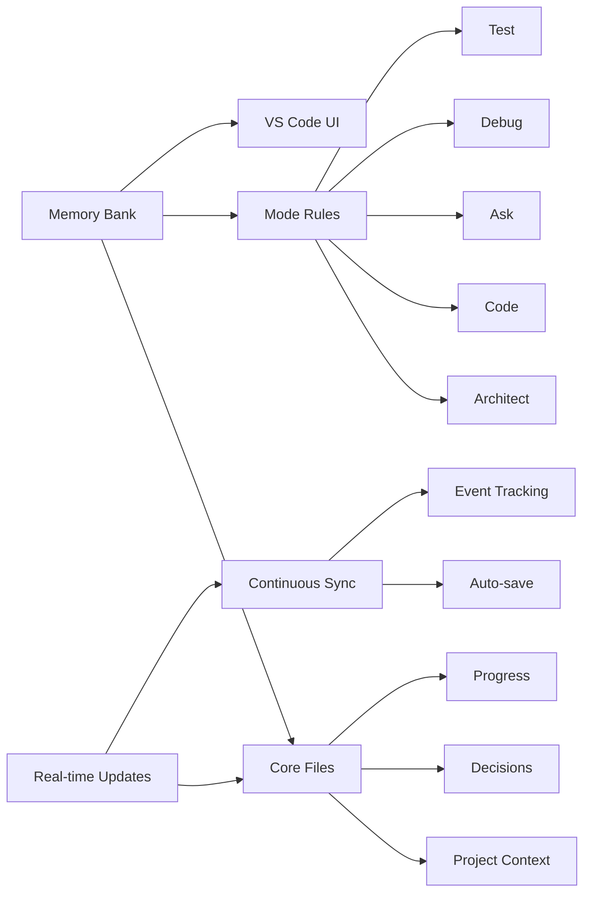
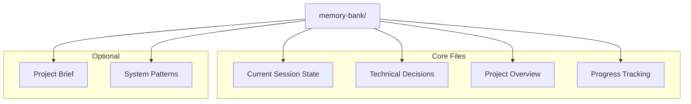
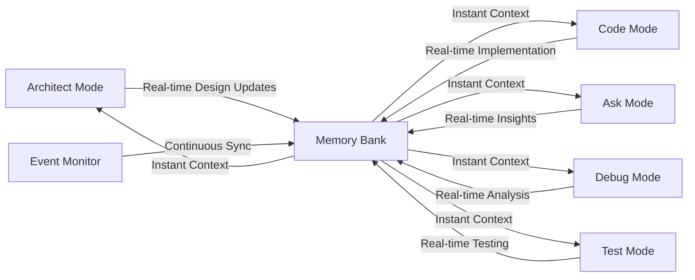
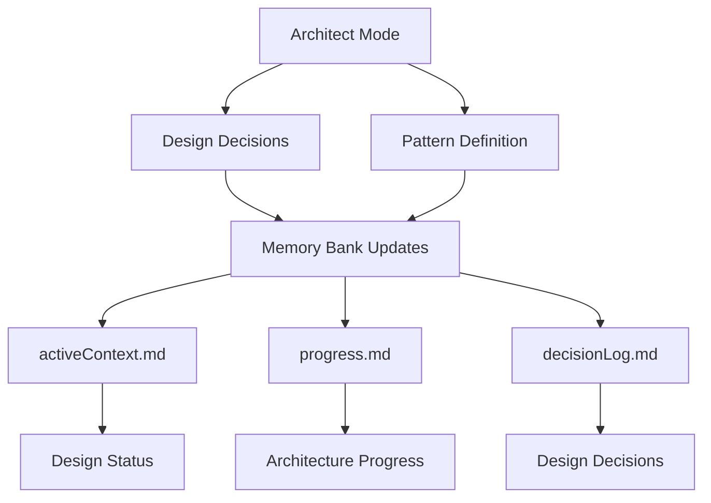
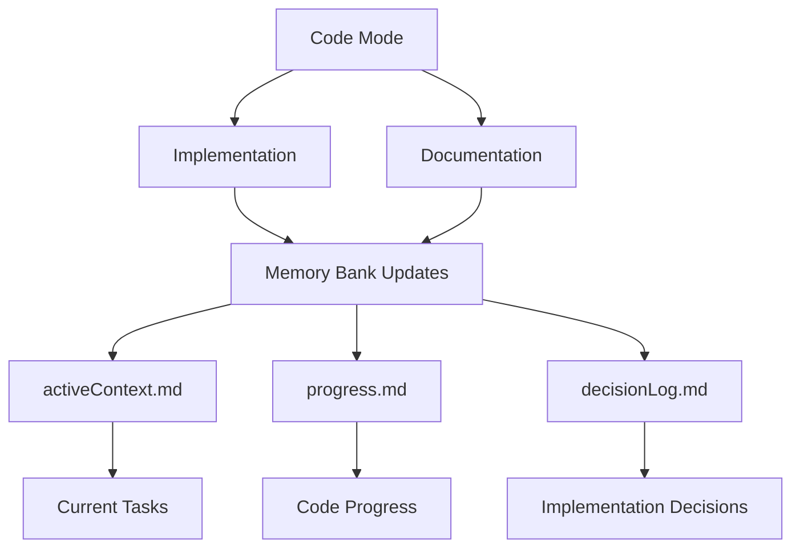
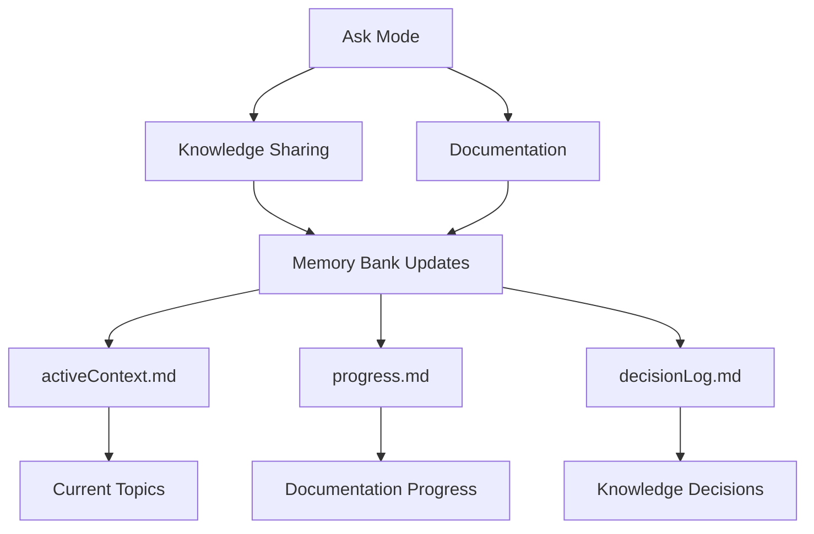
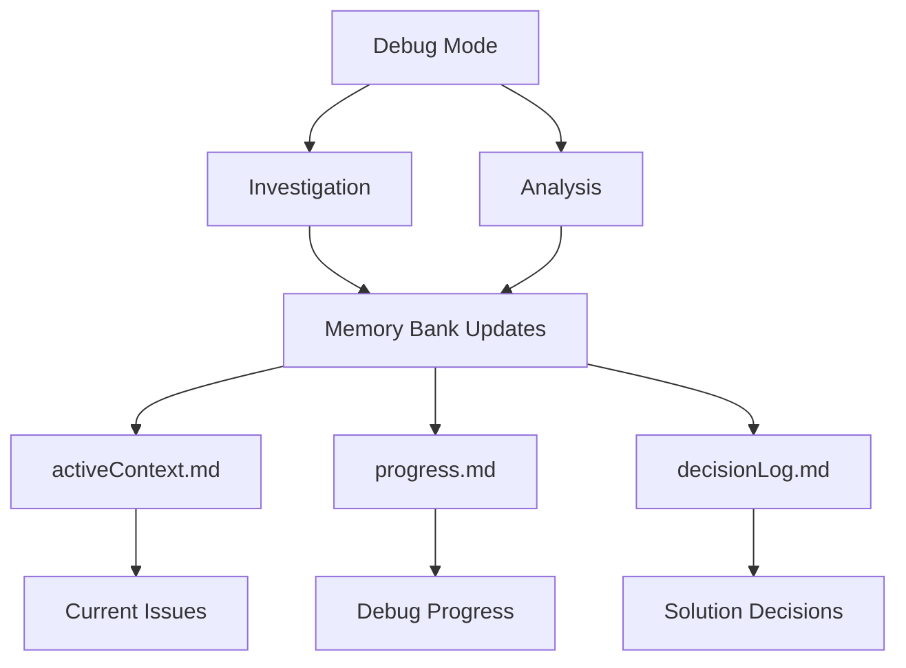
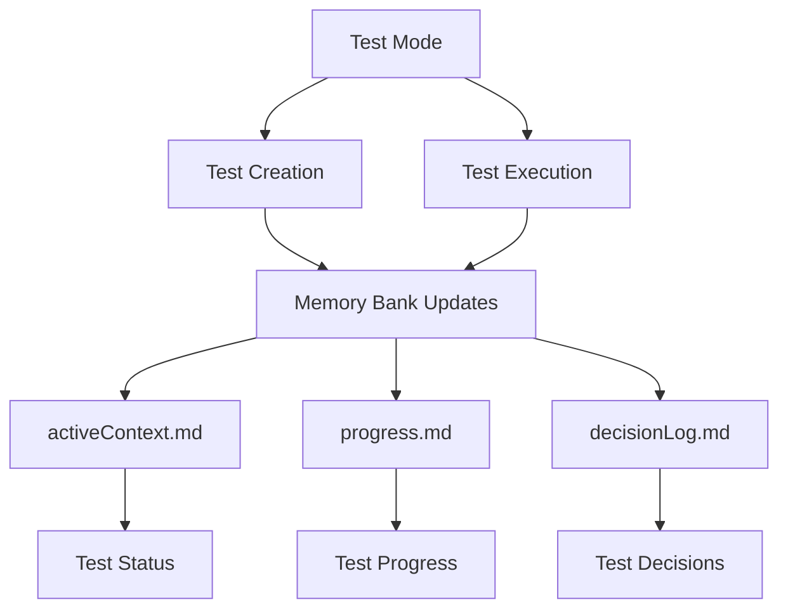

<div align="center">
    
### Be sure to give 🚀[RooFlow](https://github.com/GreatScottyMac/RooFlow)🌊 a try!

<br>

## New install scripts for [Windows](https://github.com/GreatScottyMac/roo-code-memory-bank/blob/main/config/install.cmd) and [Linux/macOS](https://github.com/GreatScottyMac/roo-code-memory-bank/blob/main/config/install.sh) !!

# 🧠 Roo Code Memory Bank

**Persistent Project Context for AI-Assisted Development**

[](https://github.com/RooVetGit/Roo-Code)
[](https://github.com/GreatScottyMac/roo-code-memory-bank)

</div>

## 🎯 Overview

Roo Code Memory Bank solves a critical challenge in AI-assisted development: **maintaining context across sessions**. By providing a structured memory system integrated with VS Code, it ensures your AI assistant maintains a deep understanding of your project across sessions.

### Key Components



- 🧠 **Memory Bank**: Persistent storage for project knowledge
- 📋 **Mode Rules**: YAML-based behavior configuration
- 🔧 **VS Code Integration**: Seamless development experience
- ⚡ **Real-time Updates**: Continuous context synchronization

## 🚀 Quick Start

### 1. Configure Custom Instructions

#### The easiest way to set up the necessary configuration files is using the provided install scripts.
**Prerequisite: Install Git:** The installation script requires `git` to be installed and accessible in your system's PATH. Download Git from [https://git-scm.com/downloads](https://git-scm.com/downloads).

#### Download and Run Install Script

1.  **Open your terminal** and navigate (`cd`) to your project's **root directory**.
2.  **Download and run the appropriate script** for your operating system using one of the commands below:
    *   **Windows (Command Prompt or PowerShell):**
        ```cmd
        curl -L -o install.cmd https://raw.githubusercontent.com/GreatScottyMac/roo-code-memory-bank/main/config/install.cmd && cmd /c install.cmd
        ```
    *   **Linux / macOS (bash/zsh):**
        ```bash
        curl -L -o install.sh https://raw.githubusercontent.com/GreatScottyMac/roo-code-memory-bank/main/config/install.sh && chmod +x install.sh && bash install.sh
        ```
    The script will download the necessary `.roorules-*`, `.roomodes`, and helper files into your project root, inject the workspace path into `.roorules-test`, and then attempt to delete the installation and helper scripts.

#### b. Configure Roo Code Prompt Settings
> ⚠️ **Important**: The system default descriptions in the Role Definition boxes can remain but leave the Mode-specific Custom Instructions boxes empty.  

### 2. Initialize Memory Bank

1. Switch to **Architect** or **Code** mode in Roo Code chat
2. Send a message (e.g., "hello")
3. Roo will automatically:
   - 🔍 Scan for `memory-bank/` directory
   - 📁 Create it if missing (with your approval)
   - 📝 Initialize core files
   - 🚦 Provide next steps

<details>
<summary>💡 Pro Tip: Project Brief</summary>

Create a `projectBrief.md` in your project root **before** initialization to give Roo immediate project context.
</details>

### File Organization

```
project-root/
├── config/
│   ├── .clinerules-architect
│   ├── .clinerules-code
│   ├── .clinerules-ask
│   ├── .clinerules-debug
│   ├── .clinerules-test
│   └── .roomodes
├── memory-bank/
│   ├── activeContext.md
│   ├── productContext.md
│   ├── progress.md
│   └── decisionLog.md
└── projectBrief.md
```

## 📚 Memory Bank Structure



<details>
<summary>📖 View File Descriptions</summary>

| File | Purpose |
|------|----------|
| `activeContext.md` | Tracks current goals, decisions, and session state |
| `decisionLog.md` | Records architectural choices and their rationale |
| `productContext.md` | Maintains high-level project context and knowledge |
| `progress.md` | Documents completed work and upcoming tasks |
| `projectBrief.md` | Contains initial project requirements (optional) |
| `systemPatterns.md` | Documents recurring patterns and standards |

</details>

## ✨ Features

### 🧠 Persistent Context
- Remembers project details across sessions
- Maintains consistent understanding of your codebase
- Tracks decisions and their rationale

### 🔄 Smart Workflows

- Mode-based operation for specialized tasks
- Automatic context switching
- Project-specific customization via rules

### 📊 Knowledge Management
- Structured documentation with clear purposes
- Technical decision tracking with rationale
- Automated progress monitoring
- Cross-referenced project knowledge

## 💡 Pro Tips

### Architect Mode
Roo Code Memory Bank's Architect mode is designed for high-level system design and project organization. This mode focuses on architectural decisions, system structure, and maintaining project-wide consistency.

#### Key Capabilities
- 🏗️ **System Design**: Create and maintain architecture
- 📐 **Pattern Definition**: Establish coding patterns and standards
- 🔄 **Project Structure**: Organize code and resources
- 📋 **Documentation**: Maintain technical documentation
- 🤝 **Team Collaboration**: Guide implementation standards

#### Real-time Update Triggers
Architect mode actively monitors and updates Memory Bank files based on:
- 🎯 Architectural decisions and changes
- 📊 System pattern definitions
- 🔄 Project structure updates
- 📝 Documentation requirements
- ⚡ Implementation guidance needs

#### Memory Bank Integration


Switch to Architect mode when you need to:
- Design system architecture
- Define coding patterns
- Structure new projects
- Guide implementations
- Make architectural decisions

### Code Mode
Roo Code Memory Bank's Code mode is your primary interface for implementation and development. This mode specializes in writing, modifying, and maintaining code while following established patterns.

#### Key Capabilities
- 💻 **Code Creation**: Write new code and features
- 🔧 **Code Modification**: Update existing implementations
- 📚 **Documentation**: Add code comments and docs
- ✨ **Quality Control**: Maintain code standards
- 🔄 **Refactoring**: Improve code structure

#### Real-time Update Triggers
Code mode actively monitors and updates Memory Bank files based on:
- 📝 Code implementations
- 🔄 Feature updates
- 🎯 Pattern applications
- ⚡ Performance improvements
- 📚 Documentation updates

#### Memory Bank Integration


Switch to Code mode when you need to:
- Implement new features
- Modify existing code
- Add documentation
- Apply coding patterns
- Refactor code

### Ask Mode
Roo Code Memory Bank's Ask mode serves as your knowledge base interface and documentation assistant. This mode excels at providing information, explaining concepts, and maintaining project knowledge.

#### Key Capabilities
- 💡 **Knowledge Sharing**: Access project insights
- 📚 **Documentation**: Create and update docs
- 🔍 **Code Explanation**: Clarify implementations
- 🤝 **Collaboration**: Share understanding
- 📖 **Pattern Education**: Explain system patterns

#### Real-time Update Triggers
Ask mode actively monitors and updates Memory Bank files based on:
- ❓ Knowledge requests
- 📝 Documentation needs
- 🔄 Pattern explanations
- 💡 Implementation insights
- 📚 Learning outcomes

#### Memory Bank Integration


Switch to Ask mode when you need to:
- Understand code patterns
- Get implementation guidance
- Create documentation
- Share knowledge
- Learn system concepts

### Debug Mode
Roo Code Memory Bank's Debug mode specializes in systematic problem-solving and troubleshooting. This mode employs strategic analysis and verification to identify and resolve issues.

#### Key Capabilities
- 🔍 **Issue Investigation**: Analyze problems systematically
- 📊 **Error Analysis**: Track error patterns
- 🎯 **Root Cause Finding**: Identify core issues
- ✅ **Solution Verification**: Validate fixes
- 📝 **Problem Documentation**: Record findings

#### Real-time Update Triggers
Debug mode actively monitors and updates Memory Bank files based on:
- 🐛 Bug discoveries
- 📈 Performance issues
- 🔄 Error patterns
- ⚡ System bottlenecks
- 📝 Fix verifications

#### Memory Bank Integration


Switch to Debug mode when you need to:
- Investigate issues
- Analyze errors
- Find root causes
- Verify fixes
- Document problems

### Test Mode
Roo Code Memory Bank includes a powerful Test mode for test-driven development and quality assurance. This mode operates with a focus on test creation, execution, and validation while maintaining code quality.

#### Key Capabilities
- 🧪 **Test-Driven Development**: Write tests before implementation
- 📊 **Test Execution**: Run and monitor test suites
- 🔍 **Coverage Analysis**: Track and improve test coverage
- 🎯 **Quality Assurance**: Validate code against requirements
- ✅ **Test Result Management**: Track and report test outcomes

#### Real-time Update Triggers
Test mode actively monitors and updates Memory Bank files based on:
- 🔄 Test executions and results
- 📈 Coverage metrics and gaps
- 🐛 Test failure patterns
- ✨ New test requirements
- 📝 Test documentation needs

#### Memory Bank Integration


Switch to Test mode when you need to:
- Write new tests
- Run test suites
- Analyze test coverage
- Validate code quality
- Document test results

### Session Management
- ⚡ **Real-time Updates**: Memory Bank automatically stays synchronized with your work
- 💾 **Manual Updates**: Use "UMB" or "update memory bank" as a fallback when:
  - Ending a session unexpectedly
  - Halting mid-task
  - Recovering from connection issues
  - Forcing a full synchronization

## 📖 Documentation

- [Developer Deep Dive](https://github.com/GreatScottyMac/roo-code-memory-bank/blob/main/developer-primer.md)
- [Update Log](https://github.com/GreatScottyMac/roo-code-memory-bank/blob/main/updates.md)

---

<div align="center">

**[View on GitHub](https://github.com/GreatScottyMac/roo-code-memory-bank) • [Report Issues](https://github.com/GreatScottyMac/roo-code-memory-bank/issues) • [Get Roo Code](https://github.com/RooVetGit/Roo-Code)**

</div>

## License

Apache 2.0 © 2025 [GreatScottyMac](LICENSE)
