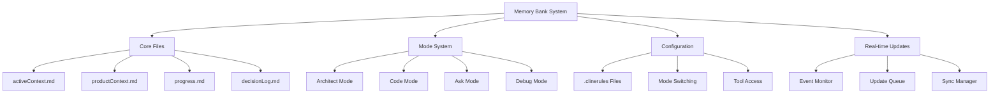
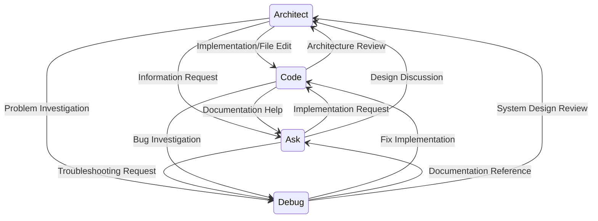

# Roo Code Memory Bank: Developer Primer

## 🏗️ System Architecture

### Core Components



## 📚 Memory Bank Structure

The Memory Bank system consists of a `memory-bank/` directory containing core and optional files:


### Core Files

1. **activeContext.md**
   - Purpose: Tracks current session state and goals
   - Content:
     - Current tasks and objectives
     - Recent changes and decisions
     - Open questions and blockers
     - Session-specific context
   - Update Frequency: Every session

2. **productContext.md**
   - Purpose: Defines project scope and core knowledge
   - Content:
     - Project overview and goals
     - Component architecture
     - Technical standards
     - Key dependencies
   - Update Frequency: When project scope changes

3. **progress.md**
   - Purpose: Tracks work status and milestones
   - Content:
     - Completed work items
     - Current tasks
     - Next steps
     - Known issues
   - Update Frequency: As tasks progress

4. **decisionLog.md**
   - Purpose: Records important decisions
   - Content:
     - Technical decisions
     - Architecture choices
     - Implementation details
     - Alternative considerations
   - Update Frequency: When decisions are made


## 🔄 Mode System

### Mode Types

1. **Architect Mode**
   - Purpose: System design and architecture
   - Capabilities:
     - Memory Bank initialization
     - Architecture decisions
     - System planning
   - File Access: Markdown files only

2. **Code Mode**
   - Purpose: Implementation and coding
   - Capabilities:
     - Full file access
     - Code generation
     - File modifications
   - No file restrictions

3. **Ask Mode**
   - Purpose: Information and guidance
   - Capabilities:
     - Context understanding
     - Documentation help
     - Best practices guidance
   - File Access: Read-only

4. **Debug Mode**
   - Purpose: Troubleshooting and problem-solving
   - Capabilities:
     - System behavior analysis
     - Incremental testing
     - Root cause identification
     - Diagnostic tooling
   - File Access: Read-only

### Intelligent Mode Switching



The system supports intelligent mode switching based on both prompt analysis and operational needs:

1. **Intent-Based Triggers**:
   ```yaml
   mode_switching:
     enabled: true
     preserve_context: true
     intent_triggers:
         code:
           - implement
           - create
           - build
           - code
           - develop
           - fix
         debug:
           - debug
           - troubleshoot
           - diagnose
           - investigate
           - analyze
           - trace
           - root cause
         architect:
           - design
           - architect
           - structure
           - plan
         ask:
           - explain
           - help
           - what
           - how
           - why
   ```

2. **Operational Triggers**:
   - **File-based**: Switches based on file operations
   - **Mode-specific**: Contextual switches based on task type
   - **Capability-based**: Switches to mode with required capabilities

3. **Context Preservation**:
   - Maintains task state across switches
   - Preserves conversation history
   - Tracks active files and operations

4. **Benefits**:
   - Natural language-driven mode selection
   - Seamless context transitions
   - Improved workflow efficiency
   - Task-appropriate mode selection


## ⚙️ Configuration System

### .clinerules Files

1. **.clinerules-architect**
   - Mode switching for non-markdown files
   - Memory Bank initialization rules
   - Architecture documentation standards

2. **.clinerules-code**
   - Full file access configuration
   - Code generation settings
   - Tool access permissions

3. **.clinerules-ask**
   - Read-only access settings
   - Mode switching for edits
   - Documentation preferences

4. **.clinerules-debug**
   - Read-only access settings
   - Diagnostic tool permissions
   - Logging and tracing configurations

### File Organization

```
project-root/
├── .clinerules-architect
├── .clinerules-code
├── .clinerules-ask
├── .clinerules-debug
├── memory-bank/
│   ├── activeContext.md
│   ├── productContext.md
│   ├── progress.md
│   └── decisionLog.md
└── projectBrief.md
```

## 🛠️ Development Workflow

### Real-time Update System

1. **Event Monitoring**
   - Continuous tracking of project-related events
   - Mode-specific update triggers
   - Automatic event classification

2. **Update Processing**
   - Immediate file updates based on event type
   - Asynchronous processing for performance
   - Priority-based update queue

3. **Sync Management**
   - Cross-reference preservation
   - Context consistency checks
   - Conflict resolution

4. **Manual Fallback (UMB)**
   - Emergency session termination
   - Mid-task interruptions
   - Connection recovery
   - Force synchronization

### Memory Bank Initialization

1. Start in Architect mode
2. System checks for `memory-bank/`
3. If missing:
   - Creates directory
   - Generates core files
   - Sets up initial context

### Session Workflow

1. **Session Start**
   - System reads all Memory Bank files
   - Builds comprehensive context
   - Loads mode-specific rules

2. **During Session**
   - Automatic mode switching as needed
   - Context updates in activeContext.md
   - Progress tracking in progress.md

3. **Session End**
   - Update progress.md
   - Record decisions in decisionLog.md
   - Plan next steps

## 🔍 Best Practices

1. **Memory Bank Management**
   - Keep files focused and organized
   - Update regularly during sessions
   - Cross-reference between files

2. **Mode Usage**
   - Start architecture work in Architect mode
   - Let automatic switching handle transitions
   - Use Ask mode for documentation

3. **Documentation**
   - Keep decisions documented
   - Update progress regularly
   - Maintain clear context

## 🐛 Troubleshooting

1. **Mode Switching Issues**
   - Verify .clinerules files
   - Check file permissions
   - Review mode switching logs

2. **Memory Bank Problems**
   - Ensure core files exist
   - Verify file structure
   - Check file permissions

3. **Context Issues**
   - Update activeContext.md
   - Review recent changes
   - Check file synchronization


Example Memory Bank Updates:


* productContext.md:
 ```markdown
 # memory-bank/productContext.md

 Project Overview
 This project is a [briefly describe your application - e.g., "task management web application"].
 We are adding user authentication to enhance security and personalize user experience.

 Key Technologies
 - [List existing technologies]
 - OAuth 2.0 (for social login - *Decision needed: which provider?*)
 - JWT (JSON Web Tokens) for session management
 - bcrypt (for password hashing)
 ```

* activeContext.md (Example - Initial state):
 ```markdown
 # memory-bank/activeContext.md

 Current Task
 Developing user authentication feature.

 Next Steps
 - 1. Plan database schema for user credentials.
 - 2. Implement user registration API endpoint.
 - 3. Implement user login API endpoint.
 - 4. Implement JWT-based authentication middleware.

 Open Questions
 - Which OAuth 2.0 provider to use (Google, GitHub, etc.)?
 - Password complexity requirements?
 - Session management strategy (e.g., refresh tokens)?
 ```

* progress.md (Example - Tracking progress):
 ```markdown
 # memory-bank/progress.md

 Work Done
 - [Initially empty]
 - [After completing database schema design]: - Database schema for user credentials designed and documented.
 - [After implementing registration API]: - User registration API endpoint implemented and tested (basic functionality).
 - [Continue updating as tasks are completed]

 To Do
 - [Initially, list all planned tasks]
 - Plan database schema for user credentials.
 - Implement user registration API endpoint.
 - Implement user login API endpoint.
 - Implement JWT-based authentication middleware.
 - Implement frontend integration for login/registration.
 - Implement session management.
 - Implement password reset functionality.
 - Write unit and integration tests for authentication.
 - [Update as tasks are completed and new tasks emerge]

 Current Status
 User authentication feature - In development - Database schema design in progress.
 - [Update status as development progresses] - User authentication feature - In development - User registration API implemented, working on login API.
 - [Upon completion] - User authentication feature - Completed and integrated.
 ```

Benefits:

- Comprehensive feature planning & documentation
- Systematic task & progress tracking
- Context maintenance across sessions
- Effective status communication

Memory Bank for Refactoring: Complex Code Module

Memory Bank Initialization: Quick Workflow

The Memory Bank initialization is largely automatic. Here’s a simplified view of the process:

1. **Start in Architect or Code Mode:** When you open a new project in VS Code and switch to Architect or Code mode, Roo Code automatically checks for a `memory-bank/`.
2. **Initialization Plan:** If `memory-bank/` is missing, Roo Code (in Architect mode) will guide you with a plan to set it up.
3. **Switch to Code Mode:** Follow Roo's prompt to switch to Code mode.
4. **Create Memory Bank Files:** In Code mode, follow Roo's plan to create the `memory-bank/` directory and the necessary files.
5. **Memory Bank Ready:** Once files are created, your Memory Bank is initialized and ready for use.


Handling Multiple Projects in a Workspace


If you have multiple projects with their own Memory Banks within your VS Code workspace, Roo Code can automatically detect them and prompt you to select the target project for the current chat session.

Handling Multiple Projects in a Workspace


If you have multiple projects with their own Memory Banks within your VS Code workspace, Roo Code can automatically detect them and prompt you to select the target project for the current chat session.


Automatic Project Detection and Selection:


1. New Chat Session: When you start a new chat session in Architect or Code mode, Roo Code scans your workspace for `memory-bank/` directories.
2. Multiple Memory Banks Found: If multiple `memory-bank/` directories are detected, Roo Code will display a prompt in the chat asking you to choose the project you want to work on.
3. Project Selection Prompt: Roo Code will display a prompt asking you to choose your project.  It will look something like this in the chat:

```text
Multiple Memory Banks detected.

Please select the project for this session:

1. poptools-app
2. Roo-Code
3. roo-code-memory-bank

Enter the number of your project choice.
```
4. Select Your Project: Enter the number corresponding to the project you want to work with and press Enter.
5. Context Loaded: Roo Code will then load the Memory Bank for the selected project and use it for the current chat session.

Example Scenario: Multi-Project Workspace

Let's say you have a workspace with multiple projects, like `webapp` and `mobile-app`, each with its own `memory-bank/` directory.

When you initiate a new chat in Architect mode, Roo Code will detect both Memory Banks and ask you to select the project you want to focus on for this session. The prompt will look similar to the example below:

```text
Multiple Memory Banks detected.

Please select the project for this session:

1. webapp
2. mobile-app

Enter the number of your project choice.
```
By choosing '1', Roo Code will then use the Memory Bank from your `webapp` project for this session.

By selecting '1', you ensure that Roo Code uses the Memory Bank from your `webapp` project for this session.


Organizing Multi-Project Workspaces:


To effectively manage multiple projects with Memory Banks:

* Keep Memory Banks at Project Roots: Ensure each project has its `memory-bank/` directory at the root level of its project directory.
* Clear Project Names: Use descriptive names for your project directories to easily identify them in the project selection prompt.
* Workspace Structure: Organize your workspace so that project directories are clearly separated.

This automatic project detection and selection feature simplifies working with multiple projects and ensures Roo Code always has the correct project context for each session.


Automatic Project Detection and Selection:


1. New Chat Session: When you start a new chat session in Architect or Code mode, Roo Code scans your workspace for `memory-bank/` directories.
2. Multiple Memory Banks Found: If multiple `memory-bank/` directories are detected, Roo Code will display a prompt in the chat asking you to choose the project you want to work on.
3. Project Selection Prompt: Roo Code will display a prompt asking you to choose your project.  It will look something like this in the chat:

```text
Multiple Memory Banks detected.

Please select the project for this session:

1. poptools-app
2. Roo-Code
3. roo-code-memory-bank

Enter the number of your project choice.
```
4. Select Your Project: Enter the number corresponding to the project you want to work with and press Enter.
5. Context Loaded: Roo Code will then load the Memory Bank for the selected project and use it for the current chat session.

Example Scenario: Multi-Project Workspace

Let's say you have a workspace with multiple projects, like `webapp` and `mobile-app`, each with its own `memory-bank/` directory.

When you initiate a new chat in Architect mode, Roo Code will detect both Memory Banks and ask you to select the project you want to focus on for this session. The prompt will look similar to the example below:

```text
Multiple Memory Banks detected.

Please select the project for this session:

1. webapp
2. mobile-app

Enter the number of your project choice.
```
By choosing '1', Roo Code will then use the Memory Bank from your `webapp` project for this session.

By selecting '1', you ensure that Roo Code uses the Memory Bank from your `webapp` project for this session.


Organizing Multi-Project Workspaces:


To effectively manage multiple projects with Memory Banks:

* Keep Memory Banks at Project Roots: Ensure each project has its `memory-bank/` directory at the root level of its project directory.
* Clear Project Names: Use descriptive names for your project directories to easily identify them in the project selection prompt.
* Workspace Structure: Organize your workspace so that project directories are clearly separated.

This automatic project detection and selection feature simplifies working with multiple projects and ensures Roo Code always has the correct project context for each session.

Example Memory Bank Updates:


* activeContext.md (Refactoring plan & progress):
 ```markdown
 # memory-bank/activeContext.md

 Current Task
 Refactoring complex `utils/legacy_module.py` module.

 Refactoring Strategy
 - 1. Analyze `utils/legacy_module.py`
 - 2. Decompose into smaller modules/functions
 - 3. Improve naming and documentation
 - 4. Write unit tests
 - 5. Gradually refactor and test

 Files to Refactor
 - `utils/legacy_module.py`

 Refactoring Progress
 - [Initially empty]
 - [After analysis]: - Analysis of `utils/legacy_module.py` completed. Refactoring strategy documented.
 - [After decomposition]: - Core functions decomposed into smaller modules in `utils/refactored_module/`.
 - [Continue updating as refactoring progresses]

 Open Questions
 -  Dependencies on `utils/legacy_module.py`?
 -  Estimated refactoring time?
 ```

* decisionLog.md (Example decisions):
 ```markdown
 # memory-bank/decisionLog.md

 Refactoring `utils/legacy_module.py` - Decisions

 - [Date]: Decision: Decompose `legacy_module.py` by functional areas.
  - Rationale: Improves modularity and maintainability.
  - Alternatives: In-place refactoring (Rejected - less impactful).

 - [Date]: Decision: Use descriptive naming and comprehensive docstrings.
  - Rationale: Improves code readability.
  - Alternatives: Minimal documentation (Rejected - insufficient).
 ```

* progress.md (Tracking refactoring progress):
 ```markdown
 # memory-bank/progress.md

 Work Done
 - [Initially empty]
 - [After analysis and planning]: - Refactoring plan for `utils/legacy_module.py` documented in `activeContext.md` and `decisionLog.md`.
 - [After decomposition]: - Core functions of `legacy_module.py` decomposed into smaller modules in `utils/refactored_module/`.
 - [Continue updating as refactoring progresses]

 To Do
 - [Initially, list all refactoring tasks]
 - Analyze `utils/legacy_module.py`.
 - Decompose into smaller modules/functions.
 - Improve naming and documentation.
 - Write unit tests for refactored modules.
 - Gradually refactor and test each module.
 - Integrate refactored modules.
 - Verify functionality after refactoring.
 - [Update as tasks are completed]

 Current Status
 Refactoring `utils/legacy_module.py` - Planning complete.
 - [Update status as refactoring progresses] - Refactoring `utils/legacy_module.py` - In progress - Core functions decomposition completed.
 - [Upon completion] - Refactoring `utils/legacy_module.py` - Completed and verified.
 ```

Benefits:

- Systematic refactoring planning & management
- Documented strategy, decisions, & progress
- Context & open question tracking
- Improved team collaboration

Memory Bank for Bug Fixing: User Login Bug


Example Memory Bank Updates:


* activeContext.md (Bug investigation & details):
 ```markdown
 # memory-bank/activeContext.md

 Current Task
 Debugging user login bug.

 Bug Details
 - Symptom: Login redirects back with "Invalid credentials" error.
 - Reported by: Users (support tickets #123, #124, #125).
 - Affected users: All users.
 - Environment: All browsers/platforms.
 - Last working version: v1.2.0 (suspect v1.2.1 regression).

 Reproduction Steps
 1. Go to login page.
 2. Enter valid username and password.
 3. Submit login form.
 4. Observe "Invalid credentials" error.

 Investigation Progress
 - [Initially empty]
 - [After investigation]: - Server logs OK. `auth/login.py` code review - OK, need debugger.
 - [Next step]: - Debug login process.
 ```

* decisionLog.md (Debugging decisions & findings):
 ```markdown
 # memory-bank/decisionLog.md

 Bug Fix - User Login Bug - Decisions

 - [Date]: Decision: Debugged `auth/login.py` - password hashing.
  - Findings: Password hashing logic correct, password comparison fails.

 - [Date]: Decision: Investigate password comparison & bcrypt version.
  - Rationale: Suspect bcrypt incompatibility.
  - Action: Revert bcrypt version (quick verification).

 - [Date]: Decision: Reverted bcrypt. Login - working.
  - Findings: Reverting bcrypt fixed bug. Confirms bcrypt issue.
  - Next Steps: Document bcrypt issue, long-term fix.
 ```

* progress.md (Bug fix progress):
 ```markdown
 # memory-bank/progress.md

 Work Done
 - [Initially empty]
 - [After initial investigation]: - User login bug documented in `activeContext.md`. Debugging started.
 - [After identifying bcrypt issue]: - Root cause: bcrypt incompatibility. Temporary fix: bcrypt version revert.

 To Do
 - [Initially, bug fix tasks]
 - Investigate user login bug.
 - Identify root cause.
 - Implement temp fix (bcrypt revert).
 - Verify temp fix.
 - Investigate long-term bcrypt solution.
 - Implement long-term fix.
 - Regression tests.
 - Deploy fix.
 - Monitor login.
 - [Update tasks as needed]

 Current Status
 User login bug - Investigating - Root cause identified (bcrypt incompatibility). Temporary fix implemented/verified.
 - [Update status as bug fix progresses] - User login bug - Fix implemented and verified. - Temporary fix deployed. Monitoring.
 - [Upon completion] - User login bug - Fixed (long-term solution implemented). - Long-term fix deployed. Regression tests added.
 ```

Benefits:

- Systematic debugging
- Documented bug details & decisions
- Bug fix progress tracking
- Context maintenance during debugging
- Facilitated knowledge sharing

Troubleshooting


`[MEMORY BANK: ACTIVE]` Prefix Not Working


Solution: Check Custom Instructions
1. Verify custom instruction settings in VS Code: Ensure all custom instruction modules are correctly configured in "Roo Code Prompts" settings, especially "Mode-specific Custom Instructions/Code".
 * Detailed Verification Checklist:
  - [ ] **Global Instructions:** Verify that you have copied the *entire content* of the file `roo-code-memory-bank/custom-instructions/global-instructions.md` and pasted it into the "Global Instructions" setting within the "Roo Code Prompts" section in VS Code settings.
  - [ ] **Mode-specific Instructions/Architect:** Verify that you have copied the *entire content* of `roo-code-memory-bank/custom-instructions/mode-arch.md` and pasted it into the "Mode-specific Instructions/Architect" setting.
  - [ ] **Mode-specific Instructions/Ask:** Verify that you have copied the *entire content* of `roo-code-memory-bank/custom-instructions/mode-ask.md` and pasted it into the "Mode-specific Instructions/Ask" setting.
  - [ ] **Mode-specific Instructions/Code:** **Crucially**, verify that you have copied the *entire content* of `roo-code-memory-bank/custom-instructions/mode-code.md` and pasted it into the "Mode-specific Custom Instructions/Code" setting. **This specific setting is essential for the `[MEMORY BANK: ACTIVE]` prefix to function correctly in Code mode.**
 * Content Integrity: Double-check that you have copied the *complete content* of *each* specified file and pasted it into the *corresponding* settings area, ensuring no content was missed or corrupted during the copy-paste process.
2. Save Settings: Verify that VS Code settings were saved after pasting instructions.
3. Confirm Code Mode: Ensure you are in "Code" mode when using `[MEMORY BANK: ACTIVE]` prefix (check Roo Code chat interface).
4. Check Prefix Syntax: Verify exact syntax: `[MEMORY BANK: ACTIVE]` (case-sensitive, spacing).


Memory Bank Not Persisting After VS Code Restart


Solution:
1. Verify Memory Bank Initialization: Confirm that you have initiated the Memory Bank initialization process by switching to Architect mode in a new project (see "Getting Started" section). Check if the `memory-bank/` folder and essential files were created at the project root after following the initialization plan provided by Roo Code in Architect mode.
2. Initial Mode Switch: After VS Code restart, switch to "Ask" or "Architect" mode *first* to trigger Memory Bank loading.
3. Use "Update Memory Bank" (UMB) Command: Use "update memory bank" or **"UMB" as a standalone prompt** at session end to explicitly trigger the comprehensive Memory Bank update and prepare for the next session.
4. Check File Paths: Verify `memory-bank/` folder is at project root; incorrect paths prevent Memory Bank access.


.clinerules Rules Not Applied


Solution:
1. File Location: Ensure `.clinerules` files (`.clinerules`, `.clinerules-code`, etc.) are at project root, alongside `memory-bank/` folder.
2. Syntax Check: Verify `.clinerules` file syntax; incorrect syntax may cause rules to be ignored.
3. Mode Relevance: Note that `.clinerules-code`, `.clinerules-architect`, `.clinerules-ask` are mode-specific.
4. Restart Roo Code (Rare):  Restart Roo Code in VS Code after major `.clinerules` changes to reload rules.


Memory Bank Files Not Updating/Saving


Solution:
1. File Permissions: Check write permissions for `memory-bank/` folder and files.
2. VS Code Errors: Check VS Code console for file saving errors.
3. Conflicting Extensions: Temporarily disable extensions that might interfere with saving.
4. Disk Space: Ensure sufficient free disk space is available.


If issues persist, consult the Roo Code documentation or community support channels for further assistance.


Revised Guidance on "Update Memory Bank" (UMB) Command:


Although not strictly *required* after every break, using the **"Update Memory Bank" (UMB) command** (typing "update memory bank" or "UMB" as a standalone prompt in chat) is **highly recommended and should be considered a best practice** for robust session management and ensuring long-term project context preservation.  **Triggering UMB as a standalone prompt ensures a comprehensive update of all Memory Bank files, guaranteeing accurate and persistent project knowledge.**


To visualize this session management process, refer to the workflow diagram below:


Session Management Workflow (`update memory bank` Command)


[//]: # (TODO: Replace ASCII diagram below with a visual flowchart image)
[//]: # (Visual flowchart image should illustrate the Session Management Workflow with `update memory bank` command. A flowchart would be more user-friendly than the current ASCII diagram.)


1. Start: Working on Project (Any Mode)
2. Step 1: User makes changes to Memory Bank files (`productContext.md`, `activeContext.md`, `progress.md`, etc.)
3. Step 2: Session End or Break?
 Yes: User initiates `update memory bank` command in chat
 No: Continue Working (Loop back to Step 1)
4. Step 3: Roo Code saves current state of Memory Bank files
5. Step 4: Memory Bank is prepared for next session
6. End: Session Managed & Memory Bank Updated


Think of it as:
* `[MEMORY BANK: ACTIVE]` Prefix:  Ensures Roo uses *documented, reliable* project context in Code mode (important for memory resets).
* `update memory bank` Command: "Save project knowledge" command. Use it to:
  * Update Memory Bank at session end/breaks.
  * Prepare for VS Code closure/workspace switch.
  * Create project history checkpoints.
